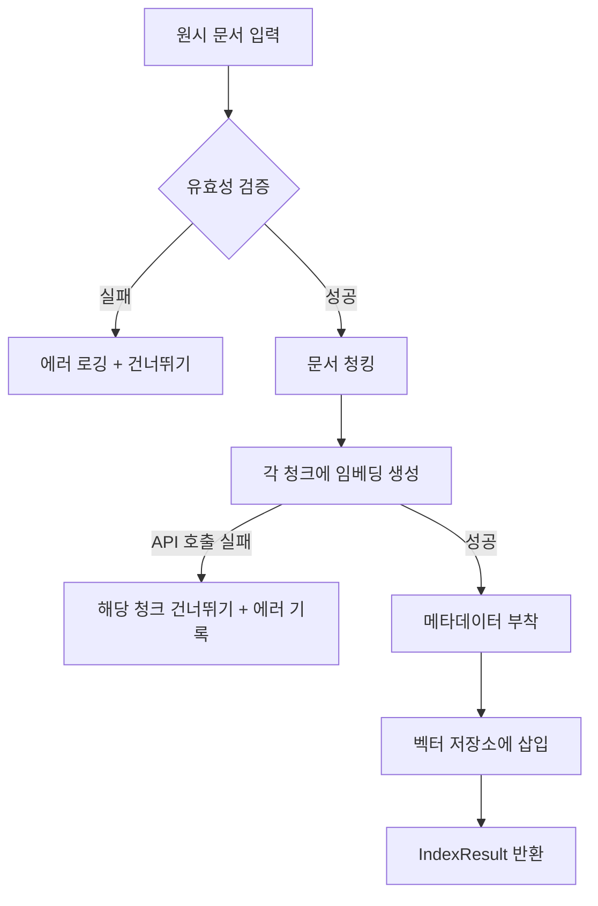
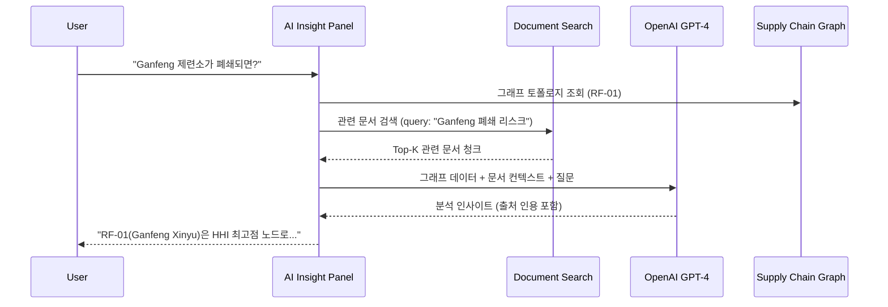

# 벡터 임베딩 저장 및 유사도 검색 가이드

## 1. 목적

Lithium Supply Chain Navigator에서 벡터 임베딩을 사용하는 이유:

1. **정책/기술 문서의 맥락적 검색** — USGS 보고서, IRA 규정, 수출 규제 문서 등에서 리튬 공급망과 관련된 정보를 의미 기반으로 검색
2. **공급망 노드와 문서 연관** — 특정 제련소나 광산과 관련된 문서 컨텍스트를 자동으로 연결
3. **AI 인사이트 강화** — LLM이 그래프 데이터와 문서 맥락을 결합하여 더 정확한 분석 제공 (RAG 패턴)

```
┌─────────────┐     ┌──────────────┐     ┌─────────────────┐
│  정책 문서   │ ──→ │  벡터 임베딩  │ ──→ │  의미 기반 검색  │
│  기술 보고서 │     │  저장소       │     │  + AI 인사이트   │
└─────────────┘     └──────────────┘     └─────────────────┘
```

---

## 2. 동작 흐름

### 2.1 문서 인덱싱 파이프라인



**단계별 설명:**

| 단계 | 설명 |
|------|------|
| ① 유효성 검증 | title, content, source, date, documentType 필수 필드 확인 |
| ② 문서 청킹 | 문단 → 문장 경계로 분할. 기본 1000자/청크, 200자 오버랩 |
| ③ 임베딩 생성 | OpenAI text-embedding-3-small API로 1536차원 벡터 생성 |
| ④ 메타데이터 부착 | source, date, document_type, pageNumber 포함 |
| ⑤ 벡터 저장 | InMemoryVectorStore (Phase 2 후반: PostgreSQL + pgvector) |

### 2.2 유사도 검색


1. 사용자 쿼리 텍스트를 동일한 임베딩 모델로 벡터 변환
2. 저장된 모든 청크와 코사인 유사도 계산
3. 유사도 내림차순 정렬 후 Top-K개 반환

---

## 3. 이 프로젝트에서의 플로우

### 3.1 아키텍처 위치

```
packages/pipeline/src/document-indexing/
├── chunker.ts          # 문서 → 청크 분할
├── embedding.ts        # 임베딩 제공자 (OpenAI / Mock)
 ├── index-document.ts   # 인덱싱 파이프라인 오케스트레이터
└── index.ts            # 모듈 진입점

apps/backend/src/
├── controllers/document-controller.ts  # API 컨트롤러
└── routes/index.ts                     # POST /api/documents/index
                                        # POST /api/documents/search
```

### 3.2 파일별 호출 플로우

```
사용자 요청: POST /api/documents/index
        │
        ▼
┌─────────────────────────────────────────────────┐
│  document-controller.ts                         │
│  documentController.indexDocument(doc)           │
└──────────────────────┬──────────────────────────┘
                       │ 위임
                       ▼
┌─────────────────────────────────────────────────┐
│  index-document.ts  (오케스트레이터)             │
│                                                 │
│  ① validateRawDocument(doc)     ← 입력 검증     │
│         │                                       │
│         ▼                                       │
│  ② chunkDocument(content, options)              │
│         │                        ← chunker.ts   │
│         ▼                                       │
│  ③ for each chunk:                              │
│       embeddingProvider(chunkContent)            │
│         │                        ← embedding.ts │
│         ▼                                       │
│  ④ vectorStore.insertChunks(documentChunks)     │
│                                  ← vector-store.ts │
└─────────────────────────────────────────────────┘
```

각 파일의 역할:

| 파일 | 역할 | 호출 순서 |
|------|------|----------|
| `chunker.ts` | 텍스트를 청크 문자열 배열로 분할 | ② |
| `embedding.ts` | 각 청크 텍스트 → 1536차원 벡터 변환 | ③ |
| `vector-store.ts` | 벡터화된 청크 저장 + 유사도 검색 | ④ |
| `index-document.ts` | 위 세 모듈을 순서대로 조율하는 오케스트레이터 | 전체 |

#### `index-document.ts` — 인덱싱 파이프라인 오케스트레이터

전체 흐름을 조율하는 진입점. 자기 자신은 비즈니스 로직을 거의 갖지 않고, 다른 모듈을 순서대로 호출하며 에러 처리를 담당한다.

```
입력: RawDocument + VectorStore + EmbeddingProvider + ChunkingOptions
출력: IndexResult { success, documentId, chunksIndexed, errors }
```

핵심 책임:
- 유효성 검증 (title, content, source, date, documentType)
- 문서 ID / 청크 ID 생성
- 임베딩 실패 시 해당 청크만 건너뛰기 (부분 성공 허용)
- 최종 결과 집계

#### `vector-store.ts` — InMemoryVectorStore

벡터를 저장하고 검색하는 데이터 계층. `VectorStore` 인터페이스를 구현한다.

| 메서드 | 기능 |
|--------|------|
| `insertChunks(chunks)` | 청크 배열을 Map에 저장 |
| `search(queryEmbedding, topK)` | 모든 청크와 코사인 유사도 계산 → 상위 K개 반환 |
| `getChunksByDocumentId(id)` | 특정 문서의 모든 청크 조회 |
| `associateWithNode(chunkIds, nodeId)` | 청크 ↔ 공급망 노드 매핑 |
| `getChunkCount()` | 저장된 총 청크 수 |

이 클래스는 향후 `PgVectorStore`(PostgreSQL + pgvector)로 교체될 수 있도록 인터페이스 기반으로 설계되어 있다.

### 3.3 API 엔드포인트

#### `POST /api/documents/index` — 문서 인덱싱

```json
// Request
{
  "title": "IRA 배터리 원산지 규정 가이드",
  "content": "2025년부터 미국 인플레이션 감축법(IRA)은...",
  "source": "US DOE",
  "date": "2025-01-15",
  "documentType": "regulation"
}

// Response
{
  "success": true,
  "documentId": "doc_IRA_배터리_원산지_규정_가이드_m1abc_xyz123",
  "chunksIndexed": 5,
  "errors": []
}
```

#### `POST /api/documents/search` — 의미 검색

```json
// Request
{
  "query": "리튬 수산화물 중국 수출 규제",
  "topK": 5
}

// Response
{
  "results": [
    {
      "id": "doc_xxx_chunk_0000",
      "documentId": "doc_xxx",
      "content": "중국 정부는 2025년 리튬 화합물에 대한...",
      "metadata": {
        "source": "MOFCOM",
        "date": "2025-03-01",
        "documentType": "regulation"
      }
    }
  ],
  "count": 5
}
```

### 3.4 AI 인사이트와의 연동 (Phase 2 후반)



### 3.5 노드 연관 기능

검색된 문서 청크를 공급망 노드와 연결하여 정성적 리스크 요인을 정량 분석에 통합한다:

```typescript
// 특정 문서 청크를 Ganfeng Xinyu 제련소 노드와 연관
documentController.associateWithNode(['chunk_001', 'chunk_002'], 'RF-01');
```

이후 RF-01 노드 조회 시 관련 문서 컨텍스트도 함께 제공된다.

### 3.6 청킹 전략

| 설정 | 기본값 | 설명 |
|------|--------|------|
| maxChunkSize | 1000자 | 한 청크의 최대 길이 |
| overlap | 200자 | 인접 청크 간 중복 영역 |

**분할 우선순위:** 문단 경계(`\n\n`) → 문장 종결 부호(`.!?。`) → 단어 경계

오버랩을 두는 이유는 청크 경계에 걸친 정보가 손실되지 않도록 하기 위함이다.

---

## 4. Phase 2 확장 계획

| 현재 (Phase 2 초기) | 향후 (Phase 2 후반) |
|---------------------|---------------------|
| InMemoryVectorStore | PostgreSQL + pgvector |
| Mock 임베딩 (개발용) | OpenAI text-embedding-3-small |
| 순차 검색 (O(n)) | pgvector IVFFlat 인덱스 |
| 단일 프로세스 | 비동기 인덱싱 큐 |

PostgreSQL + pgvector로 전환 시 `VectorStore` 인터페이스를 구현하는 `PgVectorStore` 클래스를 생성하면 기존 코드 변경 없이 교체 가능하다.
